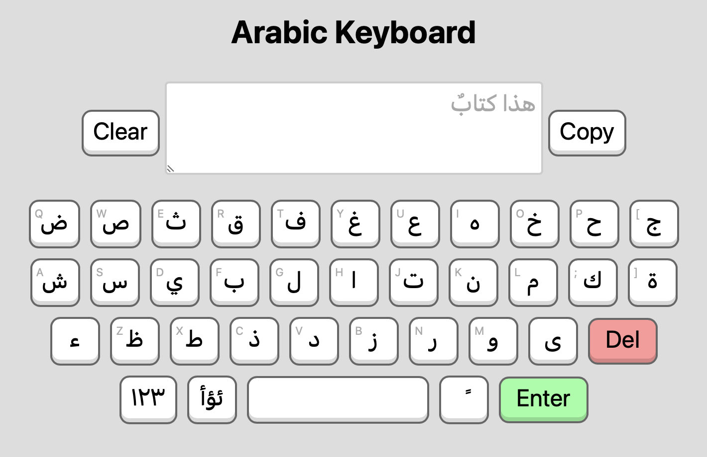

# Virtual Arabic Keyboard

Sebuah projek berupa keyboard virtual huruf Arab untuk menunjang kebutuhan menulis Arab di komputer/laptop yang tidak memiliki keyboard Arabic.

## Pratinjau

Kamu bisa melihat pratinjau projek keyboard Arab virtual pada gambar berikut.

Untuk versi live-nya, kamu bisa akses di web https://arab.ngetik.com

## Fitur yang dimiliki

Untuk saat ini keyboard virtual Arab ini memiliki fitur sebagai berikut:

- Copy (menyalin teks)
- Clear (menghapus seluruh text)
- Del (menghapus satu karakter)
- Enter (membuat baris baru)
- Menambah dan menghapus karakter di tengah kata